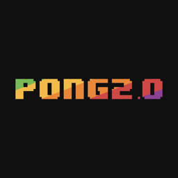

# Pong 2.0 🔥 🏓 🖥

Project made at McHacks 2018 involving reimagining the classic game of <a href="https://en.wikipedia.org/wiki/Pong">Pong</a> in three dimensions. You can play the game – in the old-fashioned way – using your mouse or keyboard, or you can step into 2018🔥 and use a <a href = "https://www.leapmotion.com">Leap Motion Controller</a> to control the game with your hands.

You can check out our dev-post for a video of the game in action with the Leap Motion Controllers <a href="https://devpost.com/software/pong2-0-ufwlvb#updates">here</a>.

## People Choice Award 🏆 🙌🏼 🎉

We are very proud to have won the People's Choice Award this year. It was great to see all the smiling faces of everyone that was able try out the game, they really enojoyed the new level of interactivity to an old game.

We used Unity to create the game physics and design, and using Leap Motion's SDK which integrates directly with Unity. The game has various input modes including mouse, keyboard, and the Leap Motion controller, and various combinations of these in signle player or multiplayer mode. The most interactive game mode is playing multiplayer with the single Leap Motion controller; it is able to independently track each hand and move each players paddle.

None of us had any prior experience with Unity and one of had used the Leap controller once; it was challenging to learn how to use these new tools but in the end we managed to demo a complete product. Next we would like to add more music and sound effects in the game, add options for the computer difficulty, and ultimately use two Leap Motion controllers in a multiplayer game.

## Design Requirements

Start menu with options:

- Single Player
- Multiplayer

### Game options

- Mouse [if single player]
- Keyboard [if Multiplayer]
- Leap Motion Controller

### Play Screen

- Countdown to start (3,2,1...)
- If single player, they are on the right side of the screen
- At the end of the game, 'Play Again', 'Main Menu'

## Strech Goals

- Add Options menu
- Two Leap Motion Sensors

## To Play the Game

Download `Final Demo.app` [macOS only]. We tried to have a windows version as well but unity does not play well with cross platform development.
